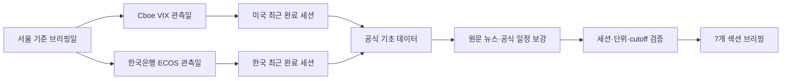

# Multi-Asset Morning Briefing

> 글로벌 주식·금리·외환·원자재·변동성을 하나의 흐름으로 연결하고, 한국시장 전달 경로와 향후 5거래일 일정을 근거 링크와 함께 정리하는 AI 에이전트 스킬

[](https://www.python.org/)
[](scripts/market_data.py)
[](#공식-데이터-원천)
[](tests/test_market_data.py)
[](https://github.com/NomaDamas/k-skill/pull/675)

## 왜 만들었나

모닝 브리핑은 숫자를 많이 모으는 것보다 **같은 세션의 숫자를 정확히 연결하는 일**이 어렵습니다.

- 서울 아침 기준 미국 오버나잇과 한국 전일의 거래일이 다를 수 있음
- 휴장·주말·발표 지연 때문에 달력상 `D-1`과 실제 최근 완료 세션이 어긋남
- 현물 종가, 선물 정산가, 장중 값이 섞이면 방향과 등락률이 충돌함
- 뉴스 제목의 단순 키워드 분류는 `공원화 → 원화` 같은 오탐을 만듦
- 한 데이터 원천의 장애가 전체 브리핑 실패로 번질 수 있음

이 스킬은 미국과 한국의 세션을 **독립 판별**하고, 공식 원천의 관측일·단위·가격 기준을 보존하며, 실패한 원천만 격리합니다.

## 결과물

파일을 만들지 않고 대화에 다음 7개 섹션을 출력합니다.

```text
YYYY.MM.DD Morning Market Briefing

1. Summary
2. Rates
3. FX
4. Commodity
5. Equity, Vol
6. 한국 증시
7. 주요 일정
```

각 bullet은 핵심 수치 또는 주장을 먼저 제시하고, 의미와 한국시장 전달 경로를 한 문장 안에서 연결하며, 직접 근거가 되는 Markdown 링크로 끝납니다.

### 실제 출력 예시

아래는 `2026-09-17 15:59 KST`에 스킬을 끝까지 실행한 결과입니다. 콘텐츠 cutoff는 `07:00 KST`, 독립 확인된 미국·한국 최근 완료 세션은 모두 `2026-09-16`이며 공식 데이터 helper의 원천 실패는 0건이었습니다. helper 실행 뒤 최소 확인 범위 전체를 공식기관·거래소·주요 통신사로 보강했으며, 검증하지 못한 항목은 그대로 표시했습니다. 시점이 고정된 실행 예시이므로 최신 브리핑은 다음 명령으로 다시 생성해야 합니다.

```bash
npx -y @nomadamas/k-skill@0 exec multi-asset-morning-briefing scripts/market_data.py -- \
  snapshot --briefing-date 2026-09-17
```

<details open>
<summary><strong>2026.09.17 Morning Market Briefing</strong></summary>

#### 1. Summary

• 연준이 기준금리 목표범위를 `3.75~4.00%`로 25bp 인상하고 연말 정책금리 중앙값을 `4.1%`로 제시해 시장의 중심축이 인하 기대에서 추가 긴축 위험으로 이동. [Federal Reserve Statement](https://www.federalreserve.gov/newsevents/pressreleases/monetary20260916a.htm) [Federal Reserve SEP](https://www.federalreserve.gov/monetarypolicy/fomcprojtabl20260916.htm)

• S&P 500 `-0.45%`, Dow `-1.21%`, Russell 2000 `-0.40%`로 약세였지만 Nasdaq `-0.01%`, SOX `+0.63%`로 반도체·기술주 상대강도 지속. [AP](https://apnews.com/article/b082e78c9b572b6b0a94b8033a0ee96b) [Nasdaq](https://indexes.nasdaq.com/index/Overview/SOX)

• 미 2년물 `+7bp`와 원/달러 `+9.2원`이 동시에 상승해 연준 인상 충격이 단기금리와 원화 약세로 전달, 외국인 수급에는 부담. [U.S. Treasury](https://home.treasury.gov/resource-center/data-chart-center/interest-rates/daily-treasury-rates.csv/2026/all?type=daily_treasury_yield_curve&field_tdr_date_value=2026&page&_format=csv) [서울경제](https://en.sedaily.com/finance/2026/09/16/won-slides-past-1370-as-oil-prices-push-us-yields-to-5)

• 유가는 전일 급등분을 일부 반납했지만 배럴당 `100달러`를 웃돌고 미국 수입물가는 전년 대비 `7.0%` 상승해 인플레이션 재가속 위험 잔존. [PFL Petroleum](https://pflpetroleum.com/reports/petroleum-daily-report-9-16-2026/) [BLS](https://www.bls.gov/news.release/ximpim.nr0.htm)

• KOSPI 주간시장의 `+1.37%` 반등과 달리 미국 상장 한국 ETF EWY는 오버나이트 `-0.54%`로 마감해 국내 반도체 강세와 연준 이후 해외 위험선호 간 괴리 확인 필요. [서울경제](https://dcb0ucee30q2g.cloudfront.net/finance/2026/09/16/kospi-rebounds-past-6700-despite-17-trillion-won-foreign) [EWY](https://stockanalysis.com/etf/ewy/)

#### 2. Rates

• 연준은 `12대 0` 만장일치로 25bp 인상해 연방기금금리 목표범위를 `3.75~4.00%`로 조정하고 지급준비금 이율을 `3.90%`로 인상, 긴축 재개 확정. [Federal Reserve](https://www.federalreserve.gov/newsevents/pressreleases/monetary20260916a.htm) [Implementation Note](https://www.federalreserve.gov/newsevents/pressreleases/monetary20260916a1.htm)

• 2026년 SEP 중앙값은 GDP `2.3%(6월 2.2%)`, 실업률 `4.1%(4.3%)`, PCE `3.7%(3.6%)`, Core PCE `3.4%(3.3%)`, 연말 정책금리 `4.1%(3.8%)`로 성장·물가·금리 전망 동반 상향. [Federal Reserve SEP](https://www.federalreserve.gov/monetarypolicy/fomcprojtabl20260916.htm)

• 미 국채 2년물 `4.74%(+7bp)`, 10년물 `5.01%(+1bp)`, 30년물 `5.35%(-1bp)`로 단기물 중심 Bear Flattening 발생. [U.S. Treasury](https://home.treasury.gov/resource-center/data-chart-center/interest-rates/daily-treasury-rates.csv/2026/all?type=daily_treasury_yield_curve&field_tdr_date_value=2026&page&_format=csv)

• 2s10s는 `+27bp`로 전일 `+33bp`에서 `6bp` 축소돼 추가 긴축 기대가 단기 구간에 집중, 성장주 할인율과 레버리지 자산에 부담. [U.S. Treasury](https://home.treasury.gov/resource-center/data-chart-center/interest-rates/daily-treasury-rates.csv/2026/all?type=daily_treasury_yield_curve&field_tdr_date_value=2026&page&_format=csv)

• 미국 8월 수입물가 `+0.7% MoM·+7.0% YoY`, 수출물가 `+0.6% MoM·+8.6% YoY`, 비연료 수입물가 `+0.8% MoM`로 관세·상품가격발 물가 압력이 연준의 추가 긴축 논리를 지지. [BLS](https://www.bls.gov/news.release/ximpim.nr0.htm)

#### 3. FX

• DXY 보조 종가는 `99.68(+0.03%)`로 상승했으며 ICE 공식 정산값이 아닌 Yahoo Finance 기반 집계값이므로 방향 확인용 SECONDARY. [Aegean DXY](https://aegeanintel.com/data/series/dxy/)

• ECB 기준 EUR/USD `1.1537(-0.02%)`, GBP/USD `1.34558(-0.20%)`로 하락해 유럽통화 대비 달러 우위 확인. [ECB](https://data-api.ecb.europa.eu/service/data/EXR/D.USD+JPY+GBP.EUR.SP00.A?format=csvdata&startPeriod=2026-09-03&endPeriod=2026-09-17)

• USD/JPY는 `155.049(+0.03%)`로 상승해 엔화 약세가 이어졌으며 일본 수입물가와 아시아 통화 변동성에는 부담. [ECB](https://data-api.ecb.europa.eu/service/data/EXR/D.USD+JPY+GBP.EUR.SP00.A?format=csvdata&startPeriod=2026-09-03&endPeriod=2026-09-17)

• 서울 현물 원/달러 종가는 `1,368.6원`, 전일 대비 `+9.2원(+0.68%)`으로 원화 약세 심화, 외국인 현물 수급에는 부담이나 수출주 환산 실적에는 완충 변수. [서울경제](https://en.sedaily.com/finance/2026/09/16/won-slides-past-1370-as-oil-prices-push-us-yields-to-5)

• 확인 가능한 동일 기준시점의 원/달러 1개월 NDF 종가를 확보하지 못해 서울 현물 종가와 오버나이트 환율을 혼합하지 않음. [한국은행 ECOS](https://ecos.bok.or.kr/)

#### 4. Commodity

• WTI 10월물은 `102.43달러/배럴(-3.21%)`, Brent 11월물은 `105.83달러/배럴(-2.69%)`에 정산돼 전일 급등분 일부 반납, 정유·에너지에는 차익실현 부담이고 항공·운송에는 비용 압력 완화. [PFL Petroleum](https://pflpetroleum.com/reports/petroleum-daily-report-9-16-2026/) [Gate](https://www.gate.com/en-us/news/detail/wti-crude-falls-340-to-10243-brent-drops-269-on-september-16-17873479)

• 유가 하락 배경은 사우디의 추가 아시아 공급과 수출 차질 완화 기대였지만 월간 상승률은 여전히 `16% 이상`으로 국내 물가·항공·화학 마진의 불확실성 지속. [PFL Petroleum](https://pflpetroleum.com/reports/petroleum-daily-report-9-16-2026/)

• COMEX 금 12월물은 `4,346.30달러/온스(+1.27%)`에 정산돼 연준 결정 전후 안전자산 수요 유지, 다만 단일 2차 원천 기준 SECONDARY. [Indy Finance](https://www.indy.finance/news/gold-settles-at-4-346-30-as-traders-brace-for-fed-rate-decision)

• LME 구리 Cash Settlement는 `14,227달러/톤(+1.30%)`, 3개월물은 `14,232달러/톤(+1.10%)`, 재고는 `254,150톤(+1.98%)`으로 가격과 재고가 동반 상승해 수요 신호로 단정하기보다 공급·재고 흐름 확인 필요. [Westmetall LME data](https://www.westmetall.com/en/markdaten.php/leistungen/en/en/westmetall.html?action=table&field=LME_Cu_cash)

#### 5. Equity, Vol

• S&P 500 `7,551.81(-0.45%)`, Dow `51,461.90(-1.21%)`, Nasdaq `25,978.42(-0.01%)`, Russell 2000 `2,858.81(-0.40%)`로 대형 기술주 대비 금융·경기민감주 상대 약세. [AP](https://apnews.com/article/b082e78c9b572b6b0a94b8033a0ee96b)

• VIX는 `17.71pt`, 전일 `17.20pt` 대비 `+0.51pt` 상승해 지수 낙폭보다 헤지 수요 증가가 두드러진 세션. [Cboe](https://cdn.cboe.com/api/global/us_indices/daily_prices/VIX_History.csv)

• SOX는 `11,246.11(+0.63%)`로 상승했고 Nvidia `+0.8%`, AMD `+1.6%`로 반도체 바스켓이 연준 인상에도 상대강도 유지. [Nasdaq](https://indexes.nasdaq.com/index/Overview/SOX) [AP](https://apnews.com/article/e2e82957e490b7be205db6013f621c3d)

• S&P 500 11개 업종 중 기술주만 `+0.12%`로 상승하고 10개 업종이 하락해 지수 보합에 가까운 Nasdaq과 달리 시장 폭은 취약. [WMTMT market note](https://www.wmtmt.com/notes/daily-2026-09-16)

• Huntington Bancshares `-5.6%`, Citizens Financial `-4.8%`, JPMorgan `-1.0%`로 은행주가 하락해 금리 인상이 금융주 전반의 즉각적 호재로 연결되지 않음. [AP](https://apnews.com/article/e2e82957e490b7be205db6013f621c3d)

• J.B. Hunt `-13.3%`는 3분기 이익이 2분기 대비 `5~10%` 감소할 수 있다는 비용 경고에 따른 개별 실적 충격, 운송주 비용 압력 확인 필요. [AP](https://apnews.com/article/e2e82957e490b7be205db6013f621c3d)

#### 6. 한국 증시

• KOSPI `6,717.97(+1.37%)`, KOSDAQ `815.98(+0.44%)`로 동반 상승해 KOSPI는 4거래일 연속 하락 뒤 반등. [한국은행 ECOS](https://ecos.bok.or.kr/api/StatisticSearch/sample/json/kr/1/10/802Y001/D/20260916/20260916) [서울경제](https://dcb0ucee30q2g.cloudfront.net/finance/2026/09/16/kospi-rebounds-past-6700-despite-17-trillion-won-foreign)

• 삼성전자 `+2.01%`, SK하이닉스 `+4.08%`로 대형 반도체가 반등을 주도했고 미국 SOX `+0.63%`가 오버나이트 상대강도 신호, 장중 외국인 수급이 지속성의 핵심 변수. [서울경제](https://dcb0ucee30q2g.cloudfront.net/finance/2026/09/16/kospi-rebounds-past-6700-despite-17-trillion-won-foreign) [Nasdaq SOX](https://indexes.nasdaq.com/index/Overview/SOX)

• KOSPI에서 기관이 약 `1.21조원` 순매수했지만 외국인은 약 `1.68조원`, 개인은 약 `1.18조원` 순매도해 지수 반등과 수급의 괴리 확대. [서울경제](https://dcb0ucee30q2g.cloudfront.net/finance/2026/09/16/kospi-rebounds-past-6700-despite-17-trillion-won-foreign)

• 미국 상장 한국 ETF EWY는 `175.54달러(-0.54%)`로 마감해 국내 현물 반등을 이어가지 못했고, 연준 인상·원화 약세를 반영한 해외 투자심리는 부담. [EWY](https://stockanalysis.com/etf/ewy/)

• 원/달러 현물 `1,368.6원(+9.2원)`과 외국인 대규모 순매도가 동반돼 환율 안정 전까지 외국인 주도 추세 전환 판단은 유보. [서울경제 FX](https://en.sedaily.com/finance/2026/09/16/won-slides-past-1370-as-oil-prices-push-us-yields-to-5) [연합뉴스](https://en.yna.co.kr/view/AEN20260916008600320)

• 동일 세션 국내 국고채 3년·10년 종가, KOSPI200 야간선물, 주요 한국 ADR의 일관된 종가를 신뢰 가능한 원천에서 교차 확인하지 못해 해당 수치는 확보하지 못함. [금융투자협회 채권정보센터](https://www.kofiabond.or.kr/)

#### 7. 주요 일정

• 향후 한국 거래일 5개는 `09.17·09.18·09.21·09.22·09.23`, 일정 시각은 모두 KST 기준. [한국은행](https://www.bok.or.kr/eng/stats/statsPublictSchdul/listCldr.do?date=25135-09&menuNo=400359) [New York Fed](https://www.newyorkfed.org/research/calendars/i-sep26.html)

• `09.17 12:00 KST` 한국은행 2026년 상반기 지식재산권 무역수지 잠정치는 서비스수지와 원화 펀더멘털 점검 변수. [한국은행](https://www.bok.or.kr/eng/stats/statsPublictSchdul/listCldr.do?date=25135-09&menuNo=400359)

• `09.17 21:30 KST(08:30 ET)` 미국 신규 실업수당 청구건수는 컨센서스 `207K`, 이전 `206K`; 같은 시각 8월 주택착공은 `1.30M` 예상, 이전 `1.239M`으로 연준 인상 직후 고용·주택 민감도 확인 핵심. [New York Fed Calendar](https://www.newyorkfed.org/research/calendars/i-sep26.html) [Census](https://www.census.gov/construction/soc/schedule.html) [WSJ survey via MarketScreener](https://www.marketscreener.com/news/housing-starts-on-tap-data-week-ahead-ce785bd2df8af126)

• `09.17 21:30 KST` 필라델피아 연은 제조업지수는 `34.0` 예상, 이전 `47.4`; `23:00 KST` 잠정주택판매는 `+0.5%` 예상, 이전 `-2.3%`로 성장 모멘텀 교차 확인 변수. [New York Fed Calendar](https://www.newyorkfed.org/research/calendars/i-sep26.html) [WSJ survey via MarketScreener](https://www.marketscreener.com/news/housing-starts-on-tap-data-week-ahead-ce785bd2df8af126)

• `09.18 06:00 KST` 한국 8월 생산자물가지수, `12:00 KST` 2025년 공공부문계정 발표로 국내 물가·재정 흐름 점검 핵심. [한국은행](https://www.bok.or.kr/eng/stats/statsPublictSchdul/listCldr.do?date=25135-09&menuNo=400359)

• `09.18 22:15 KST(09:15 ET)` 미국 8월 산업생산은 `+0.3%` 예상, 이전 `+0.2%`; 설비가동률은 `76.4%` 예상, 이전 `76.3%`로 경기 강도와 추가 긴축 여력 판단 변수. [Federal Reserve G.17](https://www.federalreserve.gov/releases/g17/) [WSJ survey via MarketScreener](https://www.marketscreener.com/news/housing-starts-on-tap-data-week-ahead-ce785bd2df8af126)

• `09.18 23:00 KST(10:00 ET)` 미국 8월 주별 고용·실업 발표로 지역별 노동시장 확산 정도 확인 필요. [BLS](https://www.bls.gov/schedule/2026/)

• `09.21 12:00 KST` 한국은행 2024년 연장표 산업연관표 발표로 반도체·에너지 가격 충격의 업종별 투입 경로 확인 필요. [한국은행](https://www.bok.or.kr/eng/stats/statsPublictSchdul/listCldr.do?date=25135-09&menuNo=400359)

• `09.22 23:00 KST(10:00 ET)` 미국 9월 리치먼드 연은 제조업지수 발표, 이전 `4`로 지역 제조업 확장 지속 여부가 경기·금리의 확인 변수. [New York Fed Calendar](https://www.newyorkfed.org/research/calendars/i-sep26.html) [Richmond Fed series](https://www.investing.com/economic-calendar/richmond-manufacturing-index-263)

• `09.23 06:00 KST` 한국 9월 소비자동향조사 발표, 8월 소비자심리지수 `104.5`에서의 반등 여부가 내수·소비 업종의 핵심 변수. [한국은행](https://www.bok.or.kr/eng/stats/statsPublictSchdul/listCldr.do?date=25135-09&menuNo=400359) [이전치](https://tradingeconomics.com/south-korea/consumer-confidence)

</details>

## 처리 흐름



## 공식 데이터 원천

| 원천 | 수집 항목 | 검증 기준 |
|---|---|---|
| [U.S. Treasury](https://home.treasury.gov/resource-center/data-chart-center/interest-rates) | 미국 국채 2Y·10Y·30Y, 2s10s | 미국 목표 세션과 동일한 관측일 |
| [Cboe](https://www.cboe.com/tradable_products/vix/) | VIX 종가, 미국 최근 완료 세션 | `pt`, regular close |
| [ECB Data Portal](https://data.ecb.europa.eu/data/datasets/EXR) | EUR/USD·USD/JPY·GBP/USD | reference rate, 통화쌍별 단위 |
| [한국은행 ECOS](https://ecos.bok.or.kr/) | KOSPI·KOSDAQ, 한국 최근 완료 세션 | `pt`, 한국시장 종가 |

로그인·API 키·프록시 없이 공개 read-only endpoint를 직접 호출합니다. FRED 시계열은 발표 지연을 명시하는 보조 fallback으로만 사용하며, 목표 세션과 관측일이 다르면 브리핑에서 제외합니다.

## 빠른 시작

### 1. 스킬 설치·갱신

```bash
npx -y @nomadamas/k-skill@0 update
```

### 2. 에이전트 지침 확인

```bash
npx -y @nomadamas/k-skill@0 instruct multi-asset-morning-briefing
```

### 3. 공식 기초 데이터 수집

```bash
npx -y @nomadamas/k-skill@0 exec multi-asset-morning-briefing scripts/market_data.py -- \
  snapshot --briefing-date 2026-09-17
```

개별 원천을 다시 확인할 수도 있습니다.

```bash
# 미국 국채 금리
npx -y @nomadamas/k-skill@0 exec multi-asset-morning-briefing scripts/market_data.py -- \
  yields --last 5 --session 2026-09-16

# Cboe VIX
npx -y @nomadamas/k-skill@0 exec multi-asset-morning-briefing scripts/market_data.py -- \
  cboe-vix --last 5 --session 2026-09-16

# ECB 주요 통화쌍
npx -y @nomadamas/k-skill@0 exec multi-asset-morning-briefing scripts/market_data.py -- \
  ecb-fx --last 5 --session 2026-09-16
```

## 신뢰성 설계

- **독립 세션 판별** — 미국은 Cboe, 한국은 ECOS의 실제 관측일로 각각 결정
- **Fail-Closed** — 세션·단위·가격 기준을 해결하지 못한 값은 추정하지 않고 제외
- **실패 격리** — 한 원천의 HTTP·파싱 실패를 `failures[]`에 기록하고 나머지 수집 지속
- **응답 크기 제한** — `Content-Length`와 스트리밍 양쪽에서 8 MiB 상한 적용
- **뉴스 cutoff** — 기본 `07:00 KST` 이후 기사를 해당 브리핑 근거에서 제외
- **공식 일정 우선** — 제3자 HTML 자동 파싱 대신 중앙은행·통계기관·기업 IR 일정 사용

## 테스트

```bash
python -m unittest discover -s multi-asset-morning-briefing/tests -p "test_*.py"
ruff format --check multi-asset-morning-briefing/scripts/market_data.py \
  multi-asset-morning-briefing/tests/test_market_data.py
ruff check multi-asset-morning-briefing/scripts/market_data.py \
  multi-asset-morning-briefing/tests/test_market_data.py
```

오프라인 테스트 30건이 다음을 검증합니다.

- 공식 CSV·JSON 파싱과 FRED ZIP 병합
- 미국·한국 휴장일이 다른 경우의 독립 세션
- 2s10s·bp 변화·curve 분류 산술
- 미국 국채·FX·VIX의 자산별 단위
- 비정상 JSON과 원천별 장애의 구조화된 실패
- 선언/스트리밍 응답 크기 제한
- 완성 브리핑의 제목·7개 섹션·링크·리서치 메모형 문체

## 저장소 구조

```text
multi-asset-morning-briefing/
├── skill.json                 # frontmatter·profile 원본
├── instruction.md             # 에이전트 workflow 원본
├── SKILL.md                   # 자동 생성 CLI adapter
├── scripts/market_data.py     # stdlib 공식 데이터 helper
├── references/format-rules.md # 산술·단위·문체 검수 규칙
└── tests/                     # 오프라인 회귀·E2E 계약 테스트
```

`SKILL.md`는 직접 편집하지 않으며 `skill.json`과 `instruction.md`에서 생성합니다.

## 기여 현황

- 제안 이슈: [NomaDamas/k-skill #674](https://github.com/NomaDamas/k-skill/issues/674)
- 업스트림 PR: [NomaDamas/k-skill #675](https://github.com/NomaDamas/k-skill/pull/675)
- 라이선스: [MIT](https://github.com/NomaDamas/k-skill/blob/dev/LICENSE)
